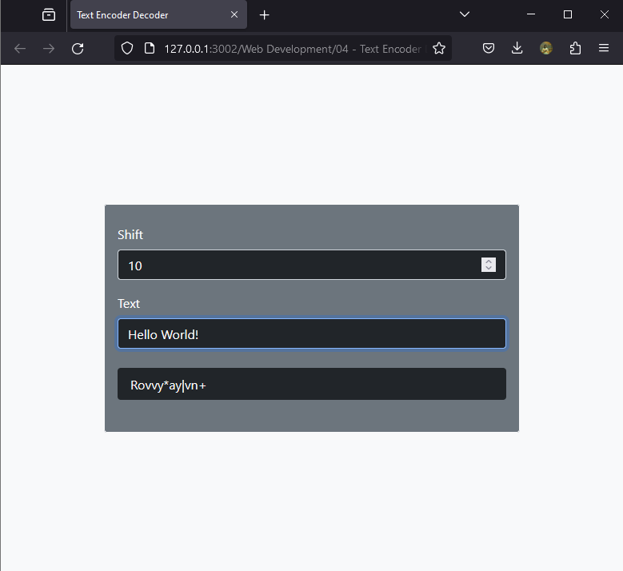
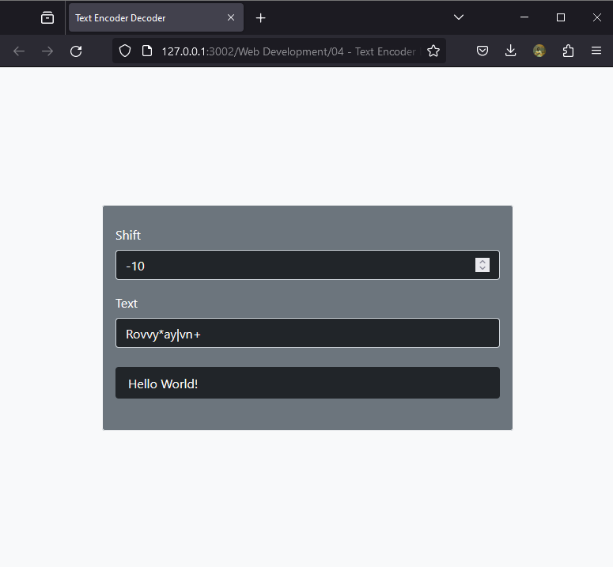

# `Text Encoder Decoder`

This piece of code `encodes` or `decodes` a given peice of text by `shifting` them `up` or `down` the ASCII Ladder. With user defined `shift range` between `-25` and `+25`. You might think it's easily crackable due to the predifined range. Yes, but imagine encoding a text that has already been encoded, more than once 😒😁😏

Feel free to modify and or play around with the code. Try increasing the shift upper and lower bound to see what happens.

`Note:` if you encode a piece of text with a positive(+x) value you have to decode with the same value but this time being negative(-x) and vice versa.

